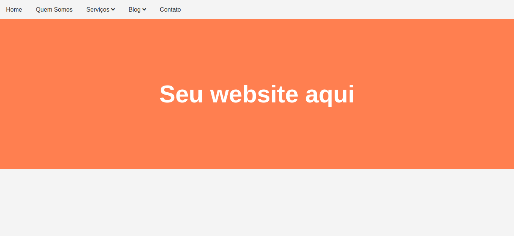
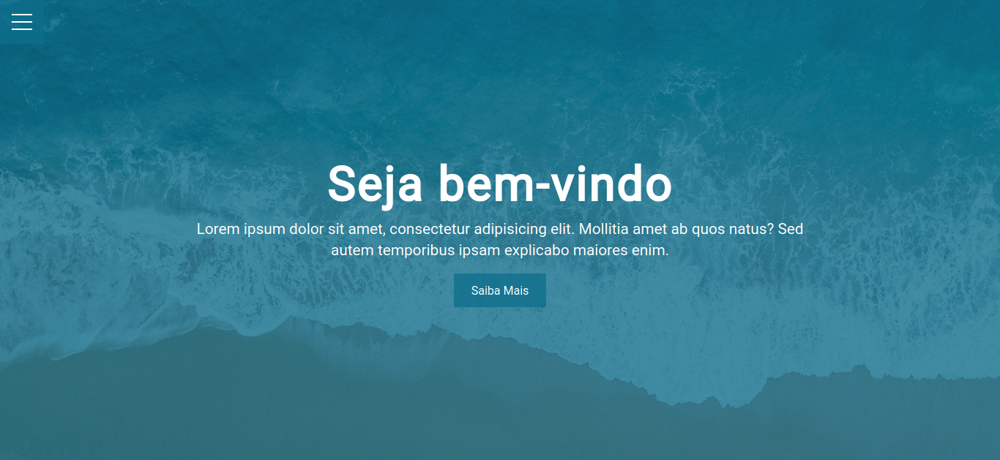
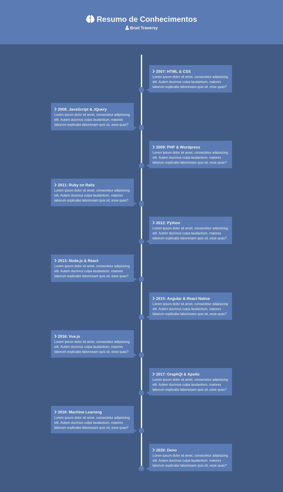
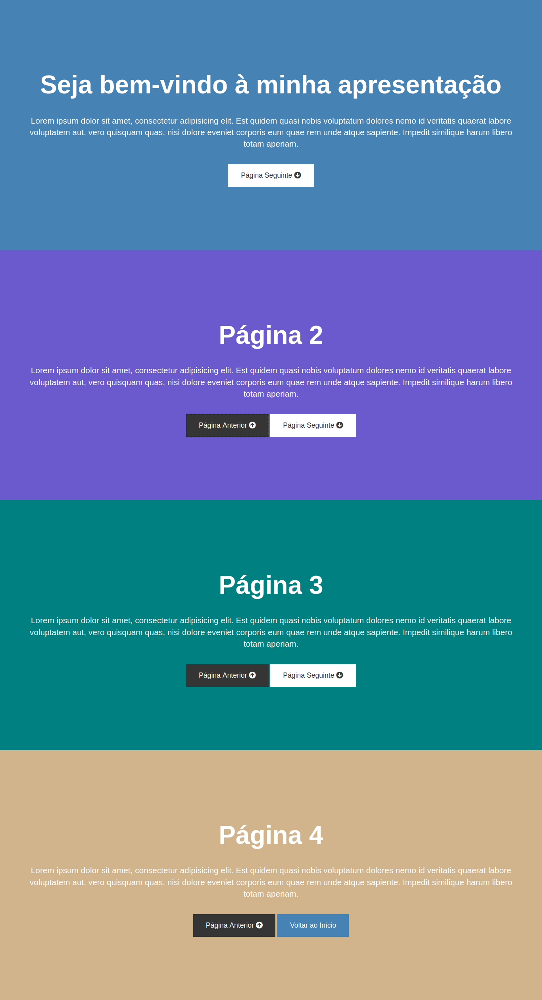

# mini-projects-with-keyframes-and-transitions

## Project

***EN:*** This is a repository that contains 4 mini projects that I created for study purposes with a focus on using the keyframes and transitions of CSS through the Modern HTML & CSS From The Beginning course by Brad Traversy.

***PT-BR:*** Este é um repositório que contém 4 mini projetos que eu criei para propósito de estudo com um foco na utilização de keyfrases e transitions do CSS através do curso Modern HTML & CSS From The Beginning de Brad Traversy.

### Specifications
- **dropdown-menu**: A dropdown navigation menu with included submenu, easy to implement in any web project.
- **hamburguer-overlay-menu**: A hamburger menu that, when clicked, has an animation and will also open a navigation list with elegant effect and dimming of the background, like a modal style.
- **knowledge-resume**: A knowledge timeline of my online instructor Brad Traversy, has small animation according to the current situation of the vertical scroll.
- **presentation-website**: A static presentation page that switches from one section to another smoothly.
***

## Technologies

This projects were developed with the following technologies:

- HTML
- CSS
- JavaScript
***
 
## Preview
#### dropdown-menu

***
#### hamburguer-overlay-menu

***
#### knowledge-resume

***
#### presentation-website

***

## License

This project is under the MIT license.
